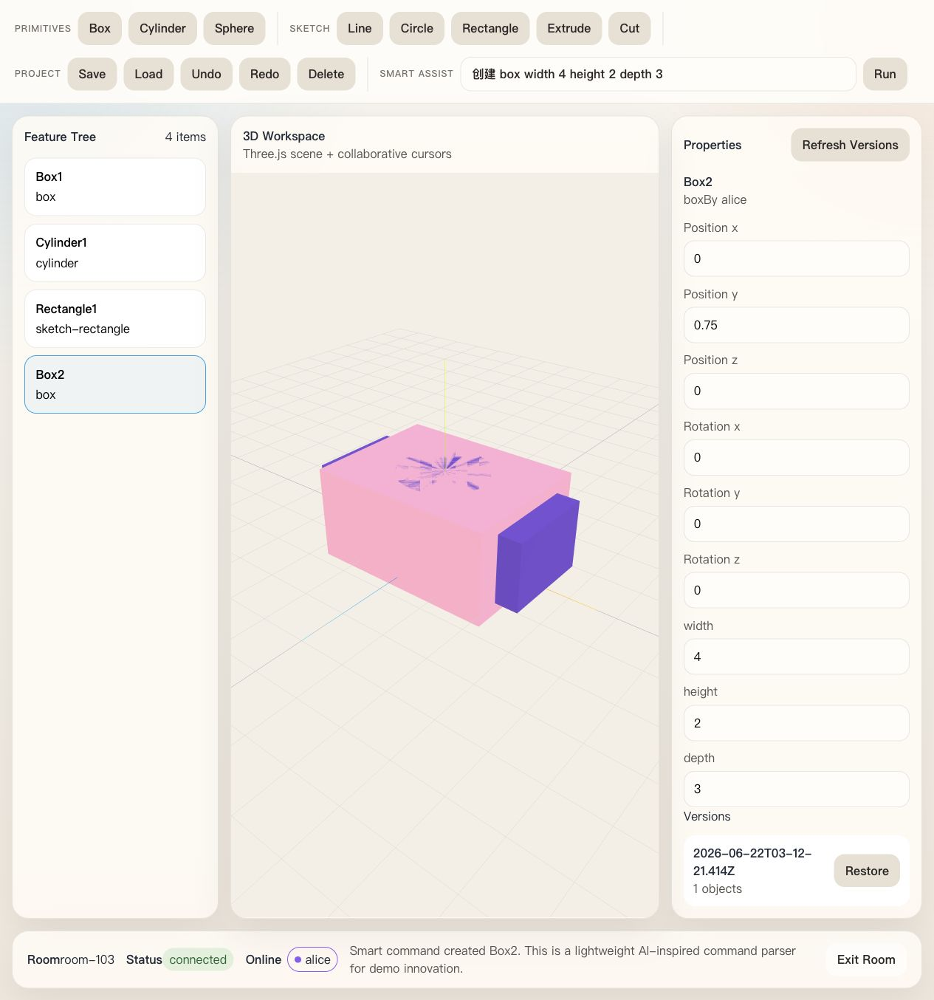

# cad-collab

《基于云的协同机械 CAD 系统设计与实现》课程设计 MVP。项目目标不是工业级 CAD，而是一个能在 macOS 本地稳定运行、支持双窗口协同演示、结构清楚、便于写报告和答辩的最小可交付版本。



## 功能概览

- React + TypeScript + Vite 前端 CAD 界面
- Three.js 3D 视图，支持 Box、Cylinder、Sphere
- Ribbon 风格工具栏、Feature Tree、属性面板、状态栏
- 草图对象：Line、Circle、Rectangle
- Extrude：可将 Rectangle / Circle 草图转成 3D 实体
- Cut：演示级简化实现，使用可视化切除标记替代完整实体布尔差
- WebSocket 协同：同房间多人实时同步 add / update / delete / cursor
- 在线用户列表、连接状态、房间 ID 展示
- Save / Load、JSON 落盘、版本快照、版本恢复
- 客户端 Undo / Redo
- Smart Assist：支持用自然语言近似命令快速创建基础对象
- 预留后续扩展方向：OpenCASCADE/Wasm、PostgreSQL、OBS、华为云部署

## 项目结构

```text
cad-collab/
  frontend/
  backend/
  docs/
    architecture.md
    course-report-draft.md
    api.md
    defense-script.md
    evaluation-checklist.md
    local-run.md
    report-outline.md
  report-latex/
  README.md
```

## 环境要求

- Node.js 18+
- macOS 本地开发环境
- 不需要 Docker

## 快速启动

1. 启动后端

```bash
cd /Users/cathy/code/caohua/cad-collab/backend
npm install
npm run dev
```

2. 启动前端

```bash
cd /Users/cathy/code/caohua/cad-collab/frontend
npm install
npm run dev
```

3. 打开浏览器

- 前端: [http://localhost:5173](http://localhost:5173)
- 后端: [http://localhost:3001](http://localhost:3001)
- WebSocket: `ws://localhost:3001/ws`

## 演示步骤

1. 打开第一个浏览器窗口，输入 `username=alice`、`roomId=room-101`，进入房间。
2. 打开第二个浏览器窗口，输入 `username=bob`、`roomId=room-101`，进入同一房间。
3. 在 A 窗口点击 `Box` 或 `Cylinder`，B 窗口会实时看到模型出现。
4. 选中对象后在右侧属性面板修改尺寸或位置，另一窗口会同步更新。
5. 新建 `Rectangle` 或 `Circle` 草图后点击 `Extrude`，生成 3D 实体。
6. 选中一个实体点击 `Cut`，看到简化的切除标记效果。
7. 在 `Smart Assist` 输入框中尝试 `创建 box width 4 height 2 depth 3`，展示智能辅助建模入口。
8. 点击 `Save`，后端会保存当前房间 JSON，并生成版本快照。
9. 刷新页面重新进入房间，点击 `Load` 可恢复后端保存状态。
10. 右侧 `Versions` 区域可查看最近版本并执行 `Restore`。
11. 使用 `Undo / Redo` 演示客户端操作回退与重做。

## 已实现能力

- 前端 CAD 界面四栏布局完成
- 3D 视图区与对象拾取完成
- 基础建模和草图数据结构完成
- 协同广播与在线状态完成
- 保存、加载、版本快照、版本恢复完成
- 智能辅助建模入口完成
- 本地 JSON 存储完成
- 课程设计说明文档完成
- LaTeX 课程报告模板与可编译正文完成

## 简化实现说明

- `Cut` 没有做完整 OpenCASCADE 级实体布尔差，而是采用演示级可视化切除标记。
- `Extrude` 只覆盖 Rectangle / Circle 草图到 3D 实体的典型流程。
- 协同冲突策略采用最后写入优先，重点保证演示稳定。
- 后端仅维护房间状态与广播，不承担复杂几何内核计算。

## 课程答辩建议

- 强调“前端重计算 + 后端轻协同”的架构取舍。
- 强调 WebSocket 操作广播、房间状态维护、版本快照机制。
- 强调课程设计目标是“可演示的云协同 CAD MVP”，而不是工业级 CAD 内核替代品。
- 明确后续扩展方向：OpenCASCADE/Wasm、PostgreSQL、OBS、JWT、华为云部署。

## 详细文档

- [系统架构](./docs/architecture.md)
- [API 说明](./docs/api.md)
- [考核项完成度总表](./docs/completion-matrix.md)
- [最终提交前审查](./docs/final-audit.md)
- [报告正文初稿](./docs/course-report-draft.md)
- [答辩演示稿](./docs/defense-script.md)
- [考核标准对照表](./docs/evaluation-checklist.md)
- [本地运行说明](./docs/local-run.md)
- [测试矩阵](./docs/testing-matrix.md)
- [课程设计报告提纲](./docs/report-outline.md)
- [LaTeX 课程报告源码](./report-latex/README.md)
