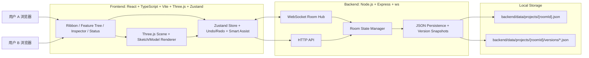
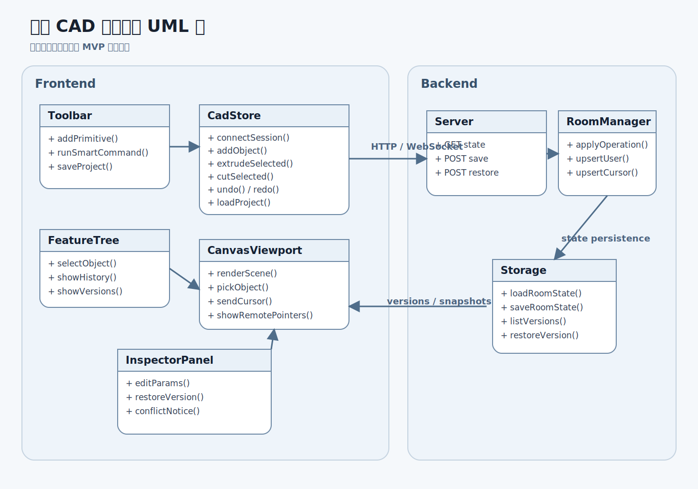
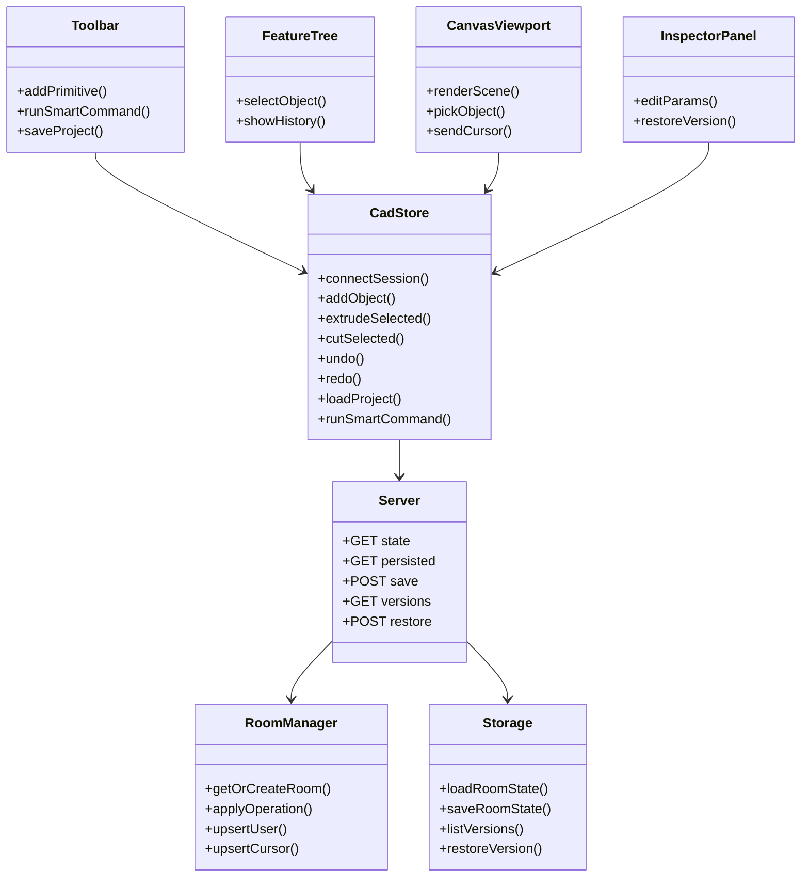
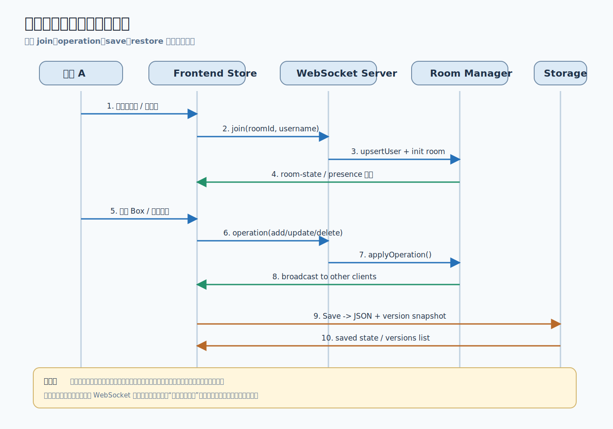
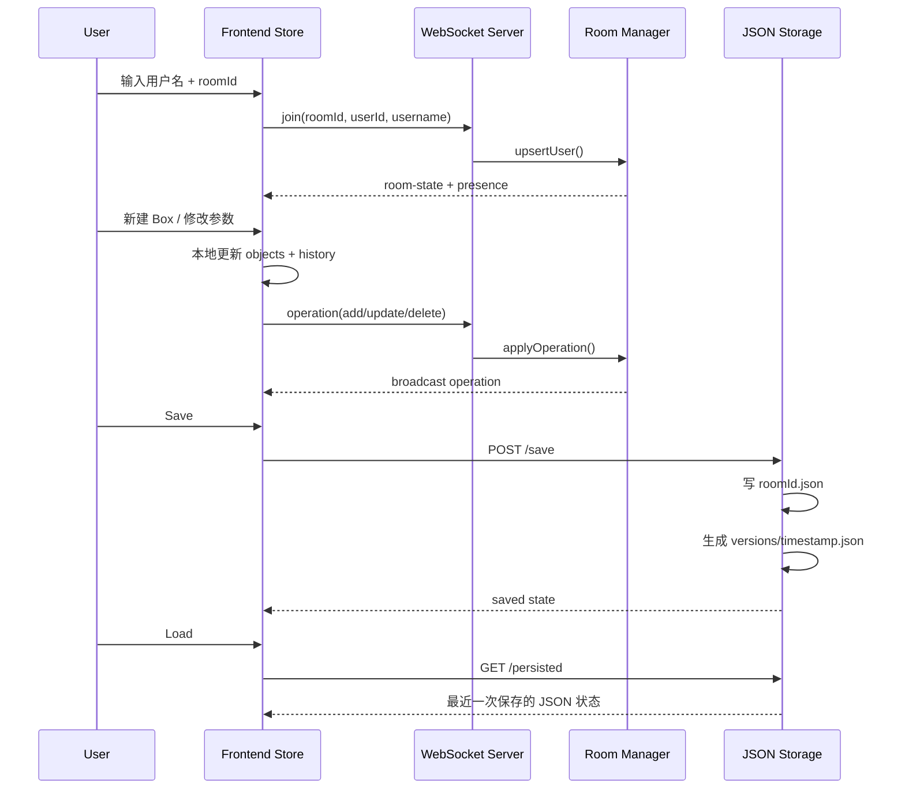
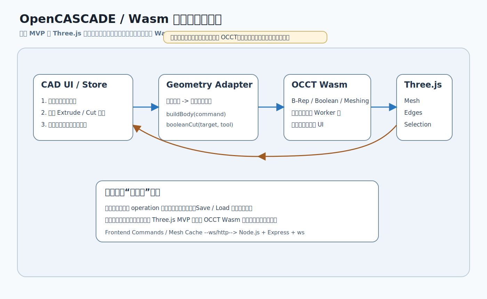
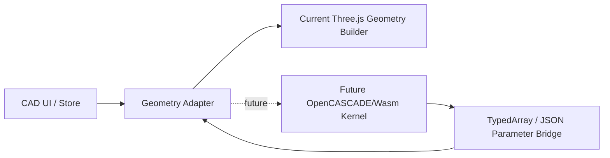

# 系统架构说明

## 1. 设计目标

本项目面向研究生课程设计答辩，目标是实现一个“基于云的协同机械 CAD 系统”最小可交付版本。核心标准是：

- 本地能稳定运行
- 双窗口协同可演示
- 架构清楚，便于讲解
- 支持基础建模、协同、保存、版本化

本项目不追求工业级几何内核能力，而是采用 Three.js 几何体 + 简化 CSG 的方式实现 MVP，并在架构中预留 OpenCASCADE/Wasm 几何内核替换位。

## 2. 总体架构图

## 3. 模块关系 UML 图

## 4. 数据流向图

## 5. 前端重计算 + 后端轻逻辑

本项目采用“前端重计算、后端轻逻辑”的架构思路：

- 前端负责建模数据编辑、Three.js 场景渲染、交互选择、Undo/Redo、智能命令辅助。
- 后端负责维护房间状态、广播操作消息、保存 JSON、生成版本快照。
- 几何实体采用 Three.js 基本几何体与挤出体生成，不在后端执行复杂实体求交。

这样做的优势是：

- 实现成本低，适合课程设计周期；
- 演示链路清晰，答辩时便于说明；
- 后续可替换为 OpenCASCADE/Wasm 几何内核而不推翻协同架构。

## 6. OpenCASCADE / Wasm 预留通信机制

当前 MVP 没有强行集成 OpenCASCADE/Wasm，而是把几何求解边界提前抽象清楚：

- 前端 `CadStore` 继续维护特征参数、对象树和操作历史；
- 几何适配层负责把 `extrude`、`cut` 等高层命令翻译为统一几何命令；
- 未来若引入 OCCT Wasm，可将其运行在浏览器 Worker 中，负责 B-Rep 建模、布尔运算和网格离散；
- Three.js 仍只负责显示网格结果、边线和选中态；
- 后端继续只做协同广播与持久化，不参与几何求解。

这种预留方式的价值在于：课程设计阶段可以用 Three.js 基础几何体稳定完成演示，而后续升级到工业级几何内核时，不需要重写协同和存储架构。

## 7. 前端模块划分

- `components/Toolbar.tsx`
  - Ribbon 风格工具栏，负责触发建模、保存加载和智能命令。
- `components/FeatureTree.tsx`
  - 显示建模历史与对象列表。
- `components/CanvasViewport.tsx`
  - Three.js 场景、模型渲染、拾取、光标同步显示。
- `components/InspectorPanel.tsx`
  - 属性编辑、版本列表、版本恢复。
- `components/StatusPanel.tsx`
  - 房间信息、在线用户、连接状态、冲突提示。
- `store/useCadStore.ts`
  - Zustand 状态中心，统一管理房间、对象、协同和历史。
- `lib/command-parser.ts`
  - 轻量自然语言命令解析器，用于演示“智能辅助建模”入口。

## 8. 后端模块划分

- `src/server.ts`
  - Express API + WebSocket Server 入口。
- `src/room-manager.ts`
  - 房间对象、在线用户、实时光标、操作应用。
- `src/storage.ts`
  - JSON 持久化、版本快照、版本恢复。
- `src/types.ts`
  - 共享消息和房间数据结构定义。

## 9. WebSocket 协同流程

### 9.1 加入房间

1. 用户在前端输入 `username` 和 `roomId`
2. 前端发起 WebSocket 连接
3. 发送 `join` 消息
4. 后端将用户加入房间并返回 `room-state`
5. 后端广播 `presence`

### 9.2 操作同步

1. 用户执行 add / update / delete / replace-state
2. 前端本地先更新 Zustand 状态
3. 前端将操作封装为 `operation` 消息发送给后端
4. 后端更新房间状态
5. 后端广播给同房间其他客户端
6. 其他客户端收到后重放操作并更新视图

### 9.3 光标同步

1. 用户移动鼠标
2. 前端按节流频率发送 `cursor` 消息
3. 后端更新房间 cursor 状态并广播
4. 其他客户端在视图区覆盖显示彩色光标标签

## 10. 冲突处理策略

MVP 中的冲突处理采用：

- 最后写入优先

实现方式：

- 后端按收到的最新操作覆盖对象状态
- 前端状态栏明确提示该策略

这样做可以减少复杂并发控制的实现成本，优先保证演示稳定。

## 11. 数据结构

### 11.1 CADObject

每个对象均包含：

- `id`
- `name`
- `type`
- `createdBy`
- `createdAt`
- `updatedAt`
- `position`
- `rotation`
- `color`
- `params`
- 可选 `sourceSketchId`
- 可选 `targetId`
- 可选 `note`

### 11.2 支持的对象类型

- `box`
- `cylinder`
- `sphere`
- `sketch-line`
- `sketch-circle`
- `sketch-rectangle`
- `extrude`
- `cut`

### 11.3 RoomState

- `roomId`
- `objects`
- `users`
- `cursors`
- `updatedAt`
- `savedAt`

## 11. 建模实现策略

### 11.1 Primitive

- Box: `THREE.BoxGeometry`
- Cylinder: `THREE.CylinderGeometry`
- Sphere: `THREE.SphereGeometry`

### 11.2 Sketch

- Line: 2D 线段
- Circle: 2D 圆轮廓
- Rectangle: 2D 矩形轮廓

草图在 MVP 中主要作为数据表达和挤出源，不做完整约束求解。

### 11.3 Extrude

- 从 `sketch-rectangle` 或 `sketch-circle` 生成 `THREE.ExtrudeGeometry`
- 支持深度参数编辑

### 11.4 Cut

- 为保证稳定演示，使用“切除区域可视化标记”替代完整布尔差集
- 文档中明确为简化实现

## 12. 智能辅助与创新性设计

为了对应“创新性”考核项，本项目增加了一个轻量智能辅助入口：

- 用户可在工具栏输入自然语言近似命令
- 例如：`创建 box width 4 height 2 depth 3`
- 系统通过规则解析器识别对象类型和参数
- 自动生成对应几何对象并同步到协同房间

当前实现特点：

- 不依赖外部大模型，保证本地演示稳定
- 体现“智能辅助设计”思路
- 为后续接入 LLM / Agent 保留接口语义

## 13. Wasm / OpenCASCADE 预留通信机制说明

虽然当前 MVP 没有直接集成 OpenCASCADE/Wasm，但架构中已经预留了几何内核替换位。

### 13.1 预留目标

- 将当前 `Three.js Geometry Builder` 抽象为 `Geometry Service`
- 前端通过统一接口提交草图、拉伸、布尔差等建模请求
- 几何计算既可由本地 JS 完成，也可由 Wasm 内核完成

### 13.2 预留通信流程

### 13.3 通信说明

- 输入侧：
  - 前端将草图、特征参数、布尔关系组织为结构化 JSON
- 桥接侧：
  - 复杂几何数据可用 `TypedArray` 传递
  - 普通参数与拓扑关系可用 JSON 传递
- 输出侧：
  - Wasm 返回网格结果、B-Rep 派生信息或错误状态
  - 前端再将结果转换为 Three.js 可渲染对象

### 13.4 这样设计的意义

- 当前课设能稳定交付
- 后续升级不必重写协同层、状态层、版本层
- 报告和答辩中可以清楚说明“当前实现”与“未来扩展”的边界

## 14. 存储设计

### 当前实现

- 房间主文件：
  - `backend/data/projects/{roomId}.json`
- 版本快照：
  - `backend/data/projects/{roomId}/versions/{timestamp}.json`

### 设计考虑

- 本地 JSON 便于调试和课程提交
- 不依赖 Docker 和数据库
- 方便展示版本快照概念

## 15. 后续扩展方向

- 几何内核升级为 OpenCASCADE/Wasm
- 存储升级为 PostgreSQL
- 模型文件资源存储升级到 OBS
- 增加 JWT 鉴权
- 部署到华为云 ECS / 云数据库 / 对象存储环境

## 16. 架构总结

该架构的关键价值在于：

- 用较低复杂度实现“云协同 CAD”核心概念
- 保留工程扩展路径
- 同时满足课程设计的可运行、可演示、可说明、可写报告四项要求
