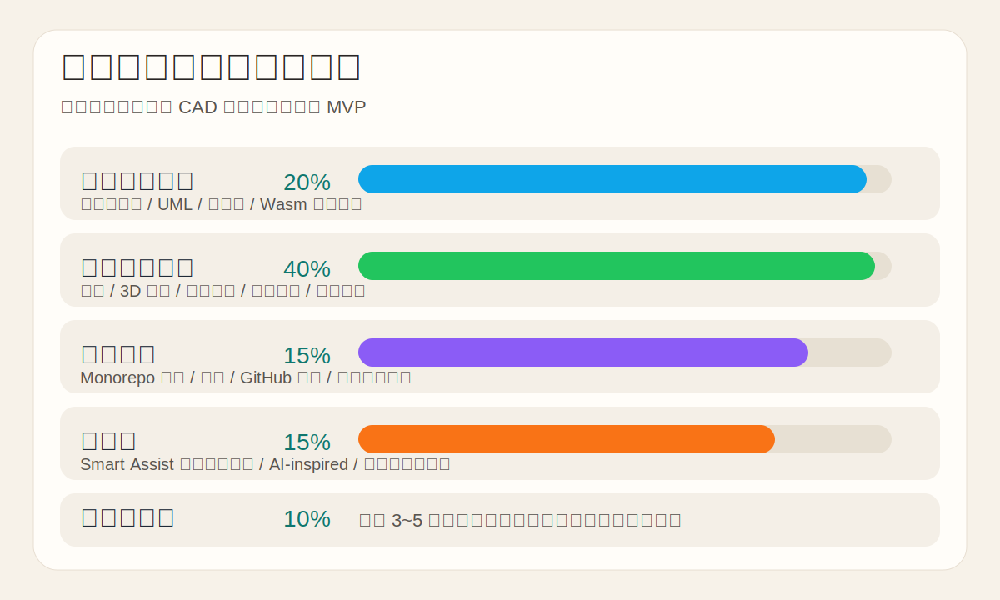

# 考核标准对照表

## 1. 架构设计文档（20%）

对应材料：

- [architecture.md](/Users/cathy/code/caohua/cad-collab/docs/architecture.md)
- [api.md](/Users/cathy/code/caohua/cad-collab/docs/api.md)

已经覆盖：

- 总体架构图
- 模块关系 UML 图
- 数据流向图
- Wasm / OpenCASCADE 预留通信机制说明

答辩提示：

- 强调“前端重计算 + 后端轻协同”
- 强调当前实现与未来扩展的边界清晰

## 2. 核心功能实现（40%）

对应材料：

- [README.md](/Users/cathy/code/caohua/cad-collab/README.md)
- [cad-workspace-demo.png](/Users/cathy/code/caohua/cad-collab/docs/images/cad-workspace-demo.png)

已经覆盖：

- Box / Cylinder / Sphere
- Line / Circle / Rectangle 草图
- Extrude
- 简化 Cut
- 双窗口协同
- 在线用户
- Save / Load / 版本恢复
- Undo / Redo

答辩提示：

- 先演示最稳定的链路，不要一上来就讲复杂原理

## 3. 代码质量（15%）

对应材料：

- GitHub 仓库：[caohua-cad-collab](https://github.com/cathylove47/caohua-cad-collab)

已经覆盖：

- `frontend / backend / docs` 分层
- 组件、状态、服务拆分
- 关键逻辑注释
- 可运行、可构建、可提交

答辩提示：

- 展示目录结构即可，不需要逐文件讲

## 4. 创新性（15%）

对应材料：

- `Smart Assist` 自然语言辅助建模入口
- [architecture.md](/Users/cathy/code/caohua/cad-collab/docs/architecture.md) 中“智能辅助与创新性设计”

已经覆盖：

- 自然语言近似命令解析
- 后续 LLM/Agent 扩展位
- Wasm 几何内核扩展位

答辩提示：

- 不要把当前实现吹成完整 AI CAD
- 应强调“轻量创新 + 可扩展设计”

## 5. 演示与答辩（10%）

对应材料：

- [defense-script.md](/Users/cathy/code/caohua/cad-collab/docs/defense-script.md)

已经覆盖：

- 3~5 分钟演示稿
- 高频问答
- 演示顺序速记卡

答辩提示：

- 先演示，再讲架构，最后讲扩展
